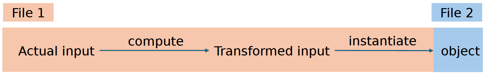
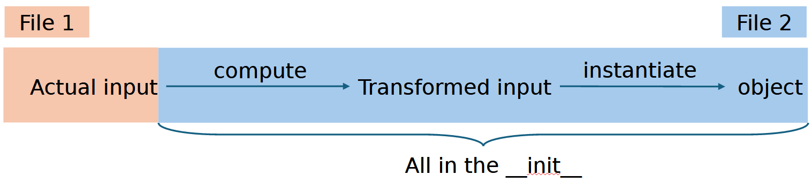
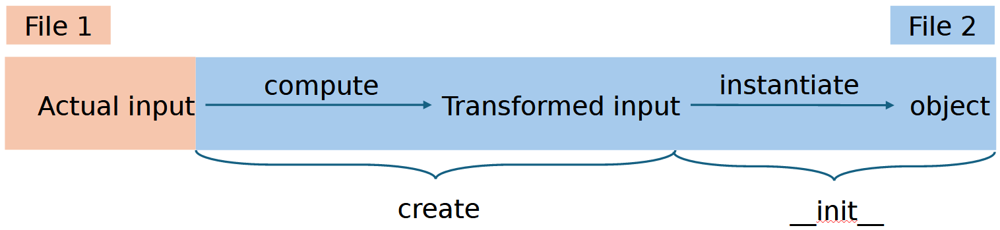

## TL;DR

🦾 When you have calculations to perform to instantiate your object, don't use `__init__`, but use a `create` classmethod instead.

📚 Combined with `pydantic`, this makes for very readable and reliable code.

📇 The advantages are: expected behavior, closeness to the object and ability to use `pydantic`.

## Background

> N.B.: This is a Python-specific post. Also, it is opinionated.

Over the past year, I have come across a lot of instances that look like this:

Data -> Specific calculations -> New Data -> Object

In words, the creation of an object requires data that is not readily available in the place where the object is created. Instead, it has to be "massaged" into place. A good example here is a database connection: you might have the connection string in a config, but the object actually should use the connection itself because it contains all the calls to that database. Naively, one might do the following:

```
class DBWrapper:
    def __init__(self, connection_string: str):
        self.connection = get_database_connection(connection_string)

    [...]
```

But is this nice?

## Analyzing the problem
I see two problems with this approach:
1. I don't think the `__init__` function should do anything, at least not anything "heavy". In the example above, creating an object calls out to a database, getting networking and authentication involved. I don't **expect** that when I simply do `wrapper = DBWrapper(abc)`. And in my book, the best code is predictable.
2. I cannot use `pydantic`. For the uninitiated, `pydantic` is a Python library that provides in-build validation and type safety that can easily be customized. And all of that while not really giving up performance. But it is quite specific about what it likes, and for `pydantic`, a class can only look like this:

```
from pydantic import BaseModel

class Test(BaseModel):
    p1: str
    [...]
```

This automatically creates an `__init__` method, which for our example would look like this: `t = Test(p1='abc')`.

> For a really good `pydantic` tutorial, check out [this tutorial](https://youtu.be/502XOB0u8OY?si=9OOArXp3GKKhQMfb) from ArjanCodes!

## Possible solutions

### Option 1: calculate the data before object is created



Using our example from before, we can simply do this:

```
database_connection = get_database_connection(connection_string)

db_wrapper = DBWrapper(database_connection=database_connection)
```

where the `DBWrapper` class would simply assign the created database_connection to the corresponding property. But that creates an issue. Now, the code responsible to do object-specific calculations does not live next to the object. For example, imagine the following setup:

- `app/model/external_connections.py`: This is the code where the object gets created
- `app/classes/wrappers/db_wrapper.py`: This is where the class code lives

This is really not uncommon for large code-bases, especially if you use your database wrapper in several places.

Now, the `app/model/external_connections.py` function needs to know about how to resolve a `connection_string`, something that should only be relevant for the `DBWrapper`.

### Option 2: calculate the data during the __init__



We already covered this case. It brings the code closer together, which is good, but in my opinion misuses the `__init__` for something that is not absolutely trivial to do. Also, to be frank, I don't like the aesthetics of `__init__`.

### Option 3: use the `create` pattern



I have found this pattern so useful and powerful, and applied it so many times that I decided to write this blog post about it. The idea is really simple: move the code that you want run when creating an object into a classmethod called `create`:

```
class DBWrapper:
    def __init__(self, connection: str):
        self.connection = connection
    
    @classmethod
    def create(cls, connection_string: str) -> "DBWrapper":
        connection = get_database_connection(connection_string)

        return cls(connection=connection)
```

Or, now using `pydantic`:

```
from pydantic import BaseModel


class DBWrapper(BaseModel):
    connection: DatabaseConnector  # This is an invented type
    
    @classmethod
    def create(cls, connection_string: str) -> "DBWrapper":
        connection = get_database_connection(connection_string)

        return cls(connection=connection)
```

This, to me, is clean code:
1. All the responsibility is where it should be: now the `external_connections.py` file only needs to call `DBWrapper.create(connection_string)` and not know what else is going on.
2. It is extensible: if the class changes, you only need to change things there.
3. By consolidating the code, it does not need to repeated when e.g. writing tests.
4. By using a separate `create` method, it is clear that something else is happening there. If I read the code and it says `create` (or even better maybe `from_connection_string`), then I know something will be happening.
5. Using `pydantic` gives me type-safety, which I really like :)

## Summary

Clean code is not one big thing, it's a lot of little choices that make a code base easy and nice to work with. I believe using the `create` pattern is one little step in that direction, if one has to calculate things to create an object.

