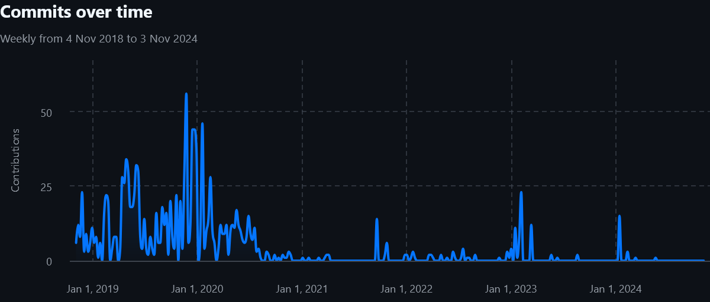
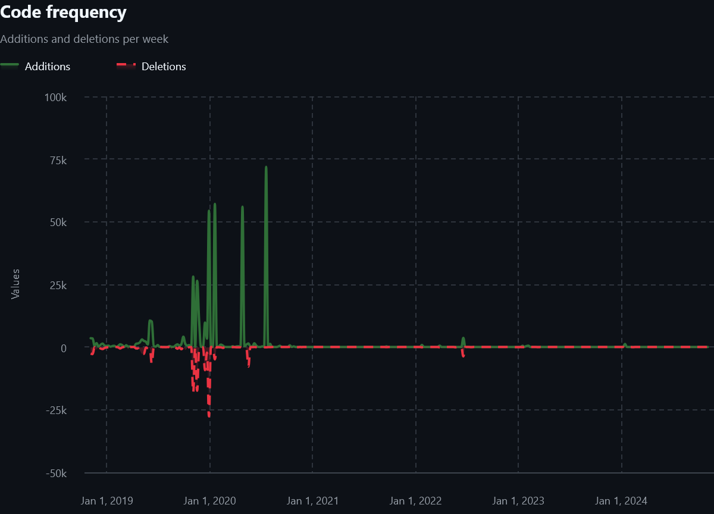

## TL;DR

🕚 `python-mip`'s latest release of 1.15.0 came in January 2023, and the latest commit to master in May 2024.

💘 With over 90 forks and 500 stars, it is one of the bigger modeling frameworks. Yet nobody is caring for it.

😦 I believe that without corporate support of open-source projects, optimization will likely not have a thriving open-source community in the long term.

## Background

`python-mip`([homepage](https://www.python-mip.com/), [GitHub](https://github.com/coin-or/python-mip)) is a well-designed modeling framework. It was created by two Brazilian researchers, [Túlio Toffolo](https://www.linkedin.com/in/tuliotoffolo/) and [Haroldo Santos](https://www.linkedin.com/in/haroldo-gambini-santos-88097b262/), in 2018, and in 2019 it was moved over to the COIN-OR umbrella. The reason I like it is that:

- It has an easy, "pythonic" syntax where there is only one way of doing things
- It interfaces with the C-library of the solvers it supports directly. This makes model building very quick

> Regarding the speed. Their docs have a ["benchmark"](https://docs.python-mip.com/en/latest/bench.html) section, which is an n-queens example with n going from 100 to 1000. This is not a benchmark, it's a single model that is not very close to reality. As I have [said](https://oberdieck.dk/p/pick-a-solver/) before: "The first rule of benchmarking is: your test set defines your test results". Nonetheless, the model building is quick in my experience. Just don't call it a benchmark.

## What's been happening?

After the initial project was pushed, I had high hopes for this framework. Hooking directly into the C-layer of the various solvers would solve a lot of issues. At the time, SCIP did not have a Python API, so I had hope that they would add it quickly and it would spread. However, this is not how it went. Let's look at the commit history for the project:

Starting in mid-2020, the number of commits drastically drops. I suspect this has something to do with Haroldo Santos joining Amazon in October 2020, as the vast majority of commits (939) came from him. Túlio Toffolo also seems to have stopped commiting regularly after mid-2020.

The project got some spikes in activity every 6 months or so, mostly driven by [Robert Schwarz](https://www.linkedin.com/in/robertcschwarz/) from Doing the Math and [Sebastian Heger](https://www.linkedin.com/in/hegersebastian/) with some input from Toffolo. We can see that still some code is added:

However Schwarz and Heger both changed roles and so since 2023, there has not been a new release since January 2023.

> Note that there is actually code in master to connect to [HiGHS](https://highs.dev/), however it is not released yet.

## Why is this an issue?

This project is good! I like it, and many others do too! It has 500 starts on Github, with close to 700k downloads from [PyPI](https://pypi.org/project/mip/). I'm sure many academics and OR professionals rely on it. It is well-written, it has docs, it even was able to excite other people to contribute. So why is it not working?

The reason, I think, is that open-source in our community is done terribly. Most tools that stick around, [pyomo](https://github.com/Pyomo/pyomo) being a notable exception, are closed-source tools. There are some new ones like [linopy](https://github.com/PyPSA/linopy) or [feloopy](https://github.com/feloopy/feloopy) which look interesting, but who knows what will happen to them in 5-10 years, when the original maintainers are running out of steam? Maybe some people will work on it for a few months or years, but in the end, I don't see a bright future.

We could really learn a lot from our machine learning cousins. The most popular machine-learning frameworks, [tensorflow](https://github.com/tensorflow/tensorflow) and [sk-learn](https://github.com/scikit-learn/scikit-learn), are open-source and extremely well maintained, thanks in large part to big corporations like Google/Alphabet playing a crucial role. A notable mention goes to [OR Tools](https://github.com/google/or-tools) though, although it hardly is the most commonly used solver or modeling framework. And of course, the user base for machine-learning products is at least one, if not several, orders of magnitude larger than the OR community.

In our industry? Very little in sight: [Gurobi](https://github.com/Gurobi) has open-sourced a number of auxiliary tools e.g for [modeling with pandas](https://github.com/Gurobi/gurobipy-pandas) or [analyzing log files](https://github.com/Gurobi/gurobi-logtools), but these are not fundamental building blocks of our industry. In a way, this is understandable though. Although Gurobi, CPLEX, Mosek etc. are commercial products, all academics have free access to them. This is great for academics, but removes a motivating factor to try and build a robust and well-performing open-source solver.

Nonetheless, COIN-OR [said it](https://www.coin-or.org/2021/12/15/future-of-coin-or/) almost three years ago:

> Over the past few months, the board has discussed these problems, and we have come to the conclusion that without change, we see no path other than to slowly wind down some of the most impactful activities of COIN-OR. This means things such as releasing and distributing binaries, testing, documentation, responding to issues and questions. Without support, these activities will no longer be organized by the COIN-OR Foundation.

Unless something fundamental changes, I'm afraid they are right.

### Acknowledgements

I would like to thank Sebastian Heger for reading a draft of the article and adding valuable comments!