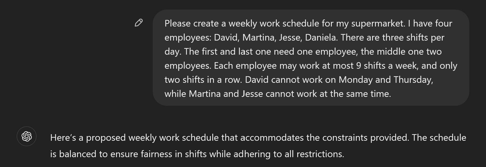
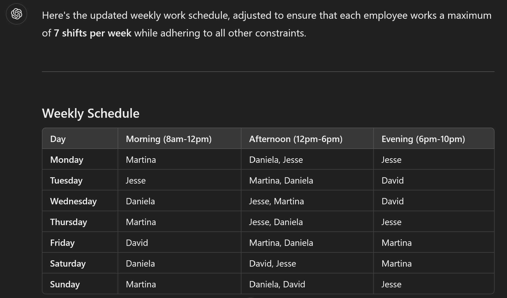
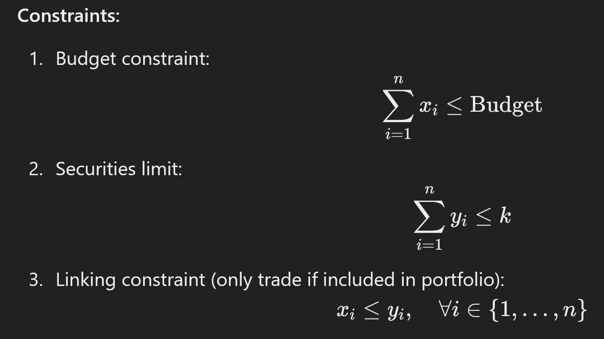

## TL;DR

💬 LLMs such as ChatGPT are everywhere, and are getting better and better at all sorts of tasks such as coding. What about optimization though?

🤌 In their current form, they can't optimize, but they will pretend like they can.

📠 The clearest use case is as an interface for developing and maintaining optimization code.

🎛 A sneaky use case is the ability to migrate code from e.g. one modeling framework to another, which works surprisingly well. This should reduce vendor lock-in for e.g. proprietary libraries of languages.

🏗 They can also be used to convert papers into code, but so far does not seem to work perfectly yet.

## Background

I've been thinking for a while about how LLMs, and statistical learning-based methods more broadly, will impact optimization. In 2017, there was a meetup event in Copenhagen about this topic and [Erling Andersen](https://www.linkedin.com/in/edandersen/) (CEO of MOSEK), said this:

> "You can never find a better solution to a TSP than an optimizer."

Somehow this has always stayed with me: optimization algorithms may not be "human-friendly", but they have been honed over decades to get better and better. So what could LLMs bring to the mix?

Three things came up recently, which got my brain sufficiently interested to investigate the current state of the art:
1. [Michael Lindahl](https://www.linkedin.com/in/michaellindahldk/) wrote an article in the Danish OR societies (DORS) magazine, and [held a keynote](https://www.euro-online.org/websites/or-in-practice/wp-content/uploads/sites/8/2024/11/Slides_MichaelLindahl.pdf) at the EURO Practitioners Forum in Coimbra, Portugal. In those, he discussed the use of LLMs and says that:
    - They hallucinate, so they cannot be a solver directlyhttps://www.linkedin.com/posts/dirkz_decisionai-ai-optimization-ugcPost-7262406027675889666-J6Z0
    - They are fun to work with
    - They are [easily fooled](https://arxiv.org/pdf/2410.05229)
2. At the EURO Practitioners Forum, we had a breakout discussion about AI and OR, which converged towards the use of LLMs. Many people praised their use, even experienced professionals like [Joaquim Gromicho](https://www.linkedin.com/in/j-gromicho/). The use case though was really as an "interface". So your optimization code on one end, and the LLM as a way to find a more "human-readable" approach to such code.
3. Gurobi [released](https://www.gurobi.com/resources/how-well-can-an-llm-answer-technical-questions-about-gurobi/) their "Gurobot" and "Gurobi AI Modeling Assistant" as GPTs on ChatGPT. Shortly after, Quantagonia [posted a video]() about their DecisionAI, which felt a lot like a GPT but they claimed to be something else; more about that later.

## What will I write about?

1. What are LLMs bad at (in the context of optimization)?
2. Are the LLM-based tools from Gurobi and Quantagonia any good?
3. What could be next?

## What are LLMs bad at?

Actual optimization. It's been well documented that LLMs until recently could not figure out how many `r`s there are in `strawberry`. So if you ask your vanilla LLM to do a staff schedule for you, it won't be great. Don't take my word for it? Check [this](https://chatgpt.com/share/6745e918-d7dc-8007-8ca2-8a762cd3ee1b) out:

I gave ChatGPT a clear description of a very simple staff scheduling problem: 4 employees, 3 shifts, a couple of constraints:

This sounds really confident! Let's look at the result:

Notice something? Well, Jesse and Martina are working the Wednesday afternoon shift together. Even though it says: "Martina and Jesse never work the same shift." (see [public link](https://chatgpt.com/share/6745e918-d7dc-8007-8ca2-8a762cd3ee1b) of the conversation). This is wrong!!

It gets better. Next I asked it that everyone can only work 7 shifts. There is a feasible solution for this, but this is not it:

Why? Because now Martina and Jesse work 8 shifts! When it lists out the schedule she is supposed to work later, it conveniently forgets the shift on Friday evening for Martina, and on Sunday evening for Jesse (again, see [link](https://chatgpt.com/share/6745e918-d7dc-8007-8ca2-8a762cd3ee1b)). **This means that it returns different solutions, in the same response!**

So what happens when we get to an infeasible solution with 6 shifts per employee? Well, this is interesting:

It figures out that this does not work. But rather than saying it is infeasible, it simply removes the shifts for Thursday, Friday and Sunday. As a cherry on top, Martina still works 7 shifts.

So, clearly, LLMs in their current incarnation are not made for this.

> Before someone says that I did not test Claude or Gemini: True, please go ahead and let me know! I would be shocked if the results would not be roughly the same.

## Are the LLM-based tools from Gurobi and Quantagonia any good?

### Gurobi

Now that we've established you cannot just use LLMs to solve optimization problems, let's see what the companies have come up with. Both Gurobi and Quantagonia came out in the past month or two with LLM-based tools to surround their optimization offering.

Gurobi went the "safe" route: create a [custom](https://medium.com/@gargg/building-your-own-custom-chatgpt-a-comprehensive-guide-3e431a1fd38c) GPT. However, weirdly, they did not create one, but rather two:
- [Gurobot](https://chatgpt.com/g/g-vPqYcfN7M-gurobot): to answer API and modeling questions
- [Gurobi AI Modeling Assistant](https://chatgpt.com/g/g-g69cy3XAp-gurobi-ai-modeling-assistant): Focus on modeling, see the docs [here](https://gurobi-ai-modeling.readthedocs.io/en/latest/)

To try them out, I asked them to write a simple portfolio optimization problem with a limited number of securities to invest. Gurobot directly [gave me](https://chatgpt.com/share/6738c43a-5424-8007-a506-b1932a154773) the implementation. Not great code, but I'll take it. It also was able to do a few modifications to the model, like converting it to a linear problem or making it multi-period. I even gave it [the docs of one of my open-source projects](), and it did a pretty good job explaining the model and implementing it in `gurobipy`.

The story for the AI Modeling Assistant was a bit [different](https://chatgpt.com/share/6745f9f5-41f8-8007-98c4-7cbf7a1a57e8): it did give me a mathematical formulation, however that one was wrong in a subtle way:

Can you see it? We have the continuous variable `x` to denote the investment and `y` to indicate whether an investment is made (since we limit the number of investments). The issue is that in the first constraint, `x` is the **absolute amount** (in e.g. USD) of the budget allocated to an investment, while the third constraint makes `x` the **portion of the amount** (no unit). Why? Because otherwise `x` would have an upper bound of 1. Interestingly, the Gurobot did not make this mistake.

Another minor difference between Gurobot and the AI Modeling Assistant? Gurobot says you need to invest all your money (`sum(x) == Budget`), while the AI Modeling Assistant allows you to not invest. While this will generally not impact the optimal solution for a simple portfolio optimization, it may become an issue when looking at fees, multi-periods etc.

This is only a single example, and as all anecdotal evidence it cannot prove anything. However, it does raise a larger question (which I will get to later): is this type of interface the future for users and/or developers? It also shows that to me, it makes no sense to have two GPTs from Gurobi. I know [Thomas Braam](https://bsky.app/profile/thomasbraam.bsky.social/post/3lbowiwcgrs2k) tried to clarify things, but I am not really the wiser. I guess they trained it on different material, but the output is kind of similar.

### Quantagonia

For those who are not familiar, Quantagonia is a German startup founded by [Dirk Zechiel](https://www.linkedin.com/in/dirkz/), [Philipp Hannemann](https://www.linkedin.com/in/philipp-hannemann/), [Sebastian Pokutta](https://www.linkedin.com/in/sebastianpokutta/) and [Sabina Jeschke](https://www.linkedin.com/in/sabina-jeschke/) in 2021. As the name suggests, they have a vision around quantum computing, however are also using classical algorithms. Their [HybridSolver](https://www.quantagonia.com/hybridsolver) used to be part of the Mittelmann benchmarks. However I could not find them in the [most recent](https://plato.asu.edu/bench.html) runs, even for the QUBO section, although this is the "best" use case for quantum in optimization.

Recently, Dirk posted [this video](https://www.linkedin.com/posts/dirkz_decisionai-ai-optimization-ugcPost-7262406027675889666-J6Z0) on LinkedIn which shows their new [DecisionAI](https://www.quantagonia.com/optimization-meets-llms). The use case they present is very much in line with Gurobi's approach, although they embed the LLM directly into their user interface. In that sense, the LLM becomes more of a **user** interface rather than a **developer** interface.

Unfortunately, Dirk did not respond to my request to test the system myself, so it is hard to know for sure.

Nonetheless, based on the video, I forsee the same issues as with Gurobot. However, due to the slick UI that sits on top of it, it will probably create an additional barrier to verification of the produced output from the LLM.

## What could be next?

This blog post argues that the current use of LLMs as code completion assistants carries over fairly well to the optimization space, if one is able to spot the occasional errors that invariably creep in. This also means that people who are just starting out in the field may go down certain rabbit holes if they only were to follow the guidance of LLM models. This is important, since the tone of the LLMs is so confident (as we saw above), even when they are wrong. So how could a novice understand when to challenge something, and when to take it at face value?

These problems will get less over time, presumably, as the models continue to improve. As they do, a few more use cases for them will open up. The two most concrete in my mind are:

1. Migrating code from one modeling framework/language to another
2. Getting code for a model published in an academic paper

### Migrating code

When I was working for Gurobi, this was a constant struggle: a prospective customer may have a model in e.g. `pyomo`, and we would like to show how nice `gurobipy` is. What to do? For an easy model, we could port it pretty quickly. But for more involved models this is simply not feasible. It gets even more complicated when going to `ampl` or `gams` code.

But now we can do better. Check out [this example](https://chatgpt.com/share/674783e4-7074-8007-bcee-1ebf5204cb5b), where I took a simple `gams` file and it was able to automatically generate valid `gurobipy` code.

I have heard that the same strategy was used by `ampl` to convert the [material](https://mobook.github.io/MO-book/intro.html) of the new [Hands-On Mathematical Optimization with Python](https://www.cambridge.org/highereducation/books/hands-on-mathematical-optimization-with-python/F15ABA8AF886E7E6F7444151F40683A1#overview) book from `pyomo` to [`ampl`](https://ampl.com/mo-book/index.html).

> On a side note: I am quite excited about this book. If it delivers, it really fills a gap in the current literature. Sadly it seems to have been pushed to January 2025, otherwise it would have been a great Christmas gift!

The power of such a change is huge for the commercial players: it means that the amount of vendor lock-in due to code is significantly reduced. Migrating old code bases will be much easier, and will enable users to move from one provider to another with ease. Ultimately, it reduces "moat", i.e. elements which make changing providers more difficult.

### Getting code for papers

> This one will take a bit more time, at least based on my initial testing. However, it will come soon I believe, and may already be possible with models such as Claude Opus.

How often have you read a paper, and just wanted to try it out? Since our community sadly does not like open-sourcing code very much (for now), this often creates a "moat", something that will take significant effort to overcome. One will only do this for papers where there is a good case to be made. Certainly, if one is a reviewer, it will not be done.

But what if you could simply take a paper or pre-print, and get the model or algorithm in (almost) working code, instantly? What would this do to peer review? And progress in our field? I [tried this out](https://chatgpt.com/share/67478912-5a40-8007-98af-52232f517ca2) with the famous ["The Price of Robustness"](https://www.mit.edu/~dbertsim/papers/Robust%20Optimization/The%20price%20of%20Robustness.pdf) paper by Bertsimas and Sim, and it did not work great. However, it was not something that seemed out of the realm of possibility.

The implications, again, are substantial:

- As a peer reviewer, one could relatively quickly test at least the basic claims of papers made.
- It will be relatively easy for an external party to create a working implementation of a paper, and even open-source it
- As a professional, it drastically reduces the time it takes to test out new ideas from academia, and check whether they survive "enemy contact"

## Conclusion

LLMs are awesome. Optimization is awesome. Their interactions have been a bit like the first part of a rom-com: there is some excitement there, but nothing that really sticks so far. However, promises of greater connections are in the air, which will benefit us tremendously.

And what will come beyond? Every time I [listen to Yann LeCun](https://youtu.be/xL6Y0dpXEwc?si=0pX_Expx7vOSmT_P) I cannot help but imagine a future where optimization algorithms are somehow tightly coupled to an abstract representation of reality generated by an LLM. Guess we'll have to wait for the credits...