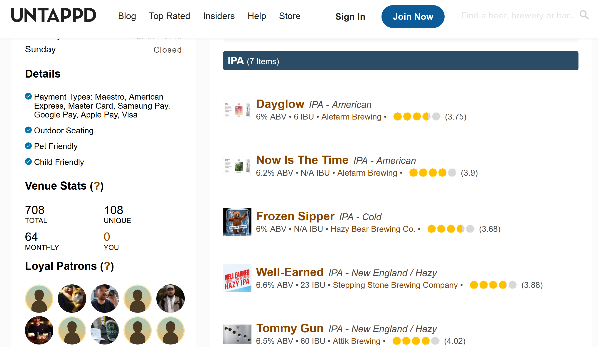
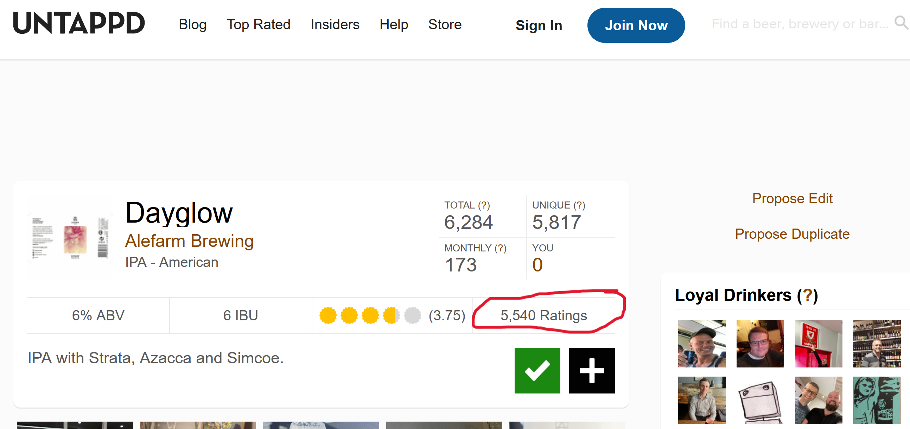

## TL;DR

🥘 With Python and `beautifulsoup4`, web scraping is really easy

🖥 The developer console is a big help

🏖 The code itself is pretty simple

## Background

One of my hobbies is to be part of a bottleshop that sells craft beer in Copenhagen called [Hos Rune](https://hos-rune.dk/). As part of that, I had hooked up the Shopify store to [Untappd](https://untappd.com/), which is a social media site for craft beer (yes, this exists), where people can check in and rate the beers they are drinking. The idea was to brings those review scores to our store, so that people could see what other people thought.

However, recently we lost access to the API, because we cannot afford to pay for the Premium subscription. So, a bit annoyed that the API access wasn't free, I decided to build a web scraper that does the same thing. So what do you need for that?

## Step 1: Define what you want to scrape

In our case it was easy: I wanted to scrape a page that looked like this, and extract the rating information for each beer:



That seemed easy enough, however it did not contain the *number* of ratings; this, you could only get when you clicked on one of the beers:



So step 1 was to lay out the scraping plan:

> Get all the beers from the main page. Then, iterate over all of the single pages to retrieve the rating information.

## Step 2: Dive into the soup

Since I'm in Python at the moment, I thought that the tried-and-tested `requests` package would be a good place to start. However, it was not cooperating:

```
response = requests.get("https://untappd.com/v/hos-rune-bottleshop/11402369")
```

[Turns out]() that I needed to add a header specifying a browser as a "User-Agent" to get my desired response code `200` back:

```
headers = {
    "User-Agent": "Mozilla/5.0 (Macintosh; Intel Mac OS X 10_10_1) AppleWebKit/537.36 (KHTML, like Gecko) Chrome/39.0.2171.95 Safari/537.36"
}
response = requests.get("https://untappd.com/v/hos-rune-bottleshop/11402369", headers=headers)
```

However, not I just have a long string of html soup. A quick search revealed my saviour: `beautifulsoup4` is a Python package that takes such a string and creates a nicely structured `html` (or `xml`) object. This way, I could easily navigate around using methods like `find`, `find_all` and `get`. Make sure to check out their docs [here](), it really is a nice package:

```
def get_all_elements_from_main_menu():
    headers = {
        "User-Agent": "Mozilla/5.0 (Macintosh; Intel Mac OS X 10_10_1) AppleWebKit/537.36 (KHTML, like Gecko) Chrome/39.0.2171.95 Safari/537.36"
    }
    response = requests.get("https://untappd.com/v/hos-rune-bottleshop/11402369", headers=headers)
    soup = BeautifulSoup(response.content, "html.parser")
    return soup.find_all("li", class_="menu-item", id="beer")
```

> This type of package is the reason Python is as popular as it is. I used to write C# code, and the tooling is just not there. On top of that, nothing like Jupyter notebooks even exists. So yeah, as [xkcd put it](https://xkcd.com/353/), "Python!".

## Step 3: Going step-by-step

For my problem at hand, this meant that the problem was actually quite simple:

```
untappd_ratings = {}
results = get_all_elements_from_main_menu()
for result in results:
    href = get_href(result)
    uid = extract_uid_from_href(href)

    beer_tag = get_beer_specific_tag(href)
    rating, rating_count = get_rating_info_from_tag(beer_tag)
```

We already looked at the `get_all_elements_from_main_menu` function, and the rest are pretty easy: we use `result.find("a").get("href")` to retrieve the hyperlink to the specific beer. Then, we get the beer-specific info in the same way we did with `get_all_elements_from_main_menu`, before we get the `rating` and `rating_count` with some more `soup` magic:

```
def get_rating_info_from_tag(beer_tag):
    rating = float(beer_tag.find("div", class_="caps").get("data-rating"))
    rating_text = beer_tag.find("p", class_="raters").text
    rating_text_list = rating_text.split()
    rating_count = int(rating_text_list[0].replace(",", ""))
    return rating, rating_count
```

## Conclusion

There is a lot more to web-scraping than this: testing, dynamic content etc. However, this post is not about that. Rather, it is meant to show how easy it is to get going with web-scraping. Personally, I somehow always thought that it would be wildly complicated, but happy to be wrong :) Also, it shows why Python is such an awesome weapon. It might not be the fastest or most elegant, but ease-of-use? Oh, absolutely!

